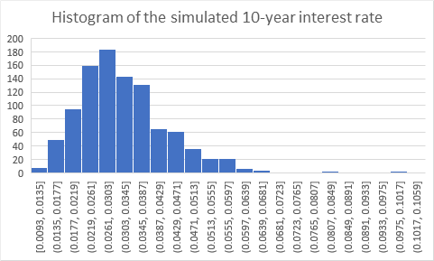
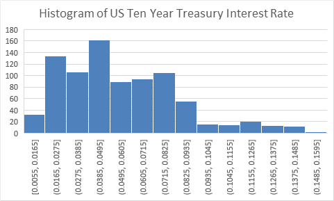

 Quiz 3 

 Jinxiang Ma 

**Question 1**  As we discussed in class, a Collateralized Mortgage Obligation (CMO) is a collection of cash flows that are crated by tranching the payments from a standard MBS pool. The underlying foundation for a Collateralized Mortgage Obligation (CMO) is the cash flows from a standard MBS pool. The only restriction on the manner in which CMO tranches are formed is that at every point in time all cash flows form the underlying mortgage-pool must be distributed as interest or principal somewhere in the CMO structure.1 At each point in time, the outstanding balance on all CMO tranches will be equal to the outstanding balance on the underlying mortgage pool.

(1) What is the reason that Collateralized Mortgage Obligations (CMOs) were introduced to the market?

> _The reason why collateralized mortgaged obligation(CMOs) were introduced to the markets is to mitigate the adverse effect of prepayment._

(2) Describe the basic idea behind a sequential pay CMO.

 >_A sequential pay CMO is a pooled debt instrument where the tranches are amortized in order of maturity. Each tranche receive interest payment as long as the tranche's principal amount has not been completely paid off. When the initial principal payement retired, the next tranche receive all the principal payments._

(3) You are advising an insurance investor client on a simple two tranche sequential CMO where the total MBS pool is 100,000,000 and the two sequential pay tranches are structured to be 50,000,000 each and are referred to as A-tranche and B-tranche. This CMO is setup for you in the spreadsheet ‘Sequential Pay Q1.xlsx’. If your client is concerned that prepayments will be high (as a percentage of PSA) and their main concern is to fund payments that are required from long-term insurance liabilities, would your recommend either A-tranche or B-tranche as a suitable investment? Why?

>_When the prepayment accelerates, the cash is flowing through faster on A-tranche, the A-tranche shortens first because it takes all of the principal prepayment. A-tranche loses its balance and gets interest payment at the same time, whereas B-tranche only gets interest payment. As soon as the A-tranche balance goes to zero, the balance of the B-tranch begins to decline. The payment of the B-tranche accelerate at the beginning but died down very quickly, so B-tranche will receive more interest and it has some protection against prepayment. Since we are focused on long-term insurance liabilities, I would recommend B-tranche as a suitable investment and it helps to prevent the maturity mismatch cause by prepayment._ 

**Question 2** Run the AIRG Economic Scenario Generator as of December 2020
(which is the default time for the file link I provided). Use 1000 scenarios, 30 year projection, Separate *.csv file for each term to maturity, monthly time step and output rates as Bond Rates (bond equivalent).

- Using the UST 10y.csv file that the AIRG Economic Scenario Generator produces, compute the mean and standard deviation of the simulated 10-year interest rate for the last 36 months of the simulation data across each path.

> The mean of the simulated 10-year interest rate for the last 36 months is 0.032787, the standard deviation is 0.012443.

- Using the UST 10y.csv file that the AIRG Economic Scenario Generator produces, prepare a histogram of the simulated 10-year interest rate for the last 36 months of the simulation data across each path.

  

- Using the GFD US ten year treasury interest rate data provided in the file ‘Quiz 3 10yr Bond Yield Data.xlsx’, compute the mean and standard deviation of the data from January 1951. Also compute a histogram for this data
  
> The mean of the US ten year treasury interest rate is 0.0551, the standard deviation is 0.029472.
  

  
- Compare the simulated 10yr interest rate output from the AIRG Economic Scenario Generator for the last 36 months of the simulation data across each path with the GFD US ten year treasury interest rate data from January 1951 (i.e. historical data). Do you think that the AIRG validates well against this historical data?

>I think AIRG doesn't perform well against historical data because AIRG data are normally distributed around 0.02, while the actual US Ten Year Treasury Interest Rate have multiple local spikes. the AIRG simulated data has a lower mean and standard deviation compared with the actual data. 

**Question 3** You are using the Dynamic Nelson-Siegel Model as discussed in class.
You have decided that the appropriate value for λ is 0.127 (i.e. λ = 0.127).

- You are told that $L = 0.03$, $S = −0.022$ and $C = 0.0155^2$ What is the resulting 10 year interest rate?

According to lecture note, we have the following formula:
$$
y_t(\tau) = L_t + S_t(\frac{1-e^{-\lambda\tau}}{\lambda\tau}) + C_t(\frac{1-e^{-\lambda\tau}}{\lambda\tau} - e^{-\lambda\tau})
$$
Since we are computing the 10 year interest rate, and $L = 0.03$, $S = −0.022$, $C = 0.0155$,$\lambda = 0.127$, we have:

$$
\begin{aligned}
    y_t(10) &= 0.03  −0.022(\frac{1-e^{-0.127*10}}{0.127*10}) + 0.0155(\frac{1-e^{-0.127*10}}{0.127*10} - e^{-0.127*10}) \\
    &= 0.03 - 0.01245 + 0.00442 \\
    &= 0.02197
\end{aligned}
$$

Hence, the resulting 10 year interest rate is 0.02197.

- We have been asked to use the model for simulating future interest rates. Explain how you would attempt to parameterize the model. [Follow the ideas that were described in class.]

According to lecture note, we have the following linear combination:
$$
y_t(\tau) = \beta_{1t} F_1(\tau) + \beta_{2t}F_2(\tau) + \beta_{3t}F_3(\tau)
$$

>Since lambda is already given in the question, which is 0.127, the basis function $F(\tau)$ for $\beta_{2t}$ and $\beta_{3t}$ can be easily computed by plugging in a muturity date $(\tau)$. Therefore, If $\lambda$ is fixed, we can use OLS to estmate each $\beta_{1t}$, $\beta_{2t}$, and $\beta_{3t}$. 
$$
M(\tau)*B = \text{DATA}(\tau)
$$
where M is the matrix of each basis function $F_{(\tau)}$, and $\text{DATA}(\tau)$ represents the bond yield panel data $y_t(\tau)$ for different muturity date, we have to compute:
$$
B=\begin{bmatrix}
\hat{\beta}_{1,t_1} & \dots & \hat{\beta}_{1,t_N}(\tau_1)\\
\hat{\beta}_{2,t_1} & \dots & \hat{\beta}_{2,t_N}(\tau_2)\\
\hat{\beta}_{3,t_1} & \dots & \hat{\beta}_{3,t_N}(\tau_3)
\end{bmatrix}
$$
The column of B represent the coordinate estimate for the yield curve at a particular point in time. We can compute ordinary least square fit of the data by minimizing the value of the betas that give us the least square error.
Now we have computed $\beta_{1t}$, $\beta_{2t}$, and $\beta_{3t}$ from time 1 to time N. We can substitude those value into to the formula for $y_t(\tau)$ to simulate future interest rate. 